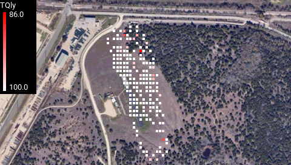

# GPS Viewer

GPS Viewer is an EdgeTX app for the Radiomaster TX16S transmitter lets users plot logged flight telemetry data with respect to location on a map.  This is especially useful for identifying areas with poor radio transmission signal quality.  This app is a modification of [Log Viewer](https://github.com/offer-shmuely/edgetx-x10-scripts/wiki/LogViewer), which is for plotting telemetry with respect to time.



## Installation

Copy gpsViewer.lua and the gpsViewer directory to the /SCRIPTS/TOOLS/ directory on your transmitter.

## Use

To open the app, press the system button on your transmitter and select the GPS Viewer app.

To move forward and backward between screens, use the next and previous page buttons on your transmitter.

To exit the app, press and hold the return button on your transmitter.

## Satellite Image

To use this app at your local airfield, add a satellite image of your airfield to the gpsViewer folder and update the following part of gpsViewer3.lua with the name of the file and the maximum and minimum longitude and latitude coordinates of your image.

```lua
-- map data
local img_map = Bitmap.open("/SCRIPTS/TOOLS/gpsViewer/arca_map.png")
local long_min = -97.6074597097314
local long_max = -97.59857623367657
local lat_min = 30.322538058896907
local lat_max = 30.326649900592205
```

## Log File Requirements

For the app to function, the logged flight data must have a "GPS" column with latitude and longitude separated by a space.  e.g. "30.324000 -97.603500".

Log files larger than 2MB are ignored.