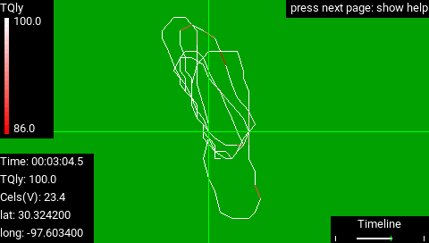

# GPS Viewer

GPS Viewer is an EdgeTX app for the Radiomaster TX16S transmitter that lets users plot logged flight telemetry data with respect to location on a map.  This is especially useful for identifying areas with poor radio transmission signal quality.

It can also be used to
- tune radio antenna alignment,
- assess GPS data accuracy before using it for autonomous flight,
- assess flight path consistency over multiple laps for racing and aerobatic competitions,
- verify that the aircraft remains within the desired airspace,
- and locate crashed aircraft.

Special thanks to Lee from the Painless360 Youtube channel for covering some of these use cases in more detail in the video below.

GPS Viewer is based on [Log Viewer](https://github.com/offer-shmuely/edgetx-x10-scripts/wiki/LogViewer) by Offer Shmuely, which is for plotting telemetry with respect to time.

## Installation

Copy the `SCRIPTS` directory to your transmitter.

Optionally also copy the `LOGS` directory to your transmitter if you'd like to have a sample log file with which to try out the app.

## Use

To open the app, press the system button on your transmitter and select GPS Viewer.

1. Select log files to index.  This step determines which fields have data that changes over time and takes about 30 seconds per MB.  To keep log files small and indexing fast, it is recommended to use a logging interval of at least 1 second in EdgeTX.

    

2. Select a log file from the index.

    

3. Select fields to plot and a map to plot on.  Fields with data that doesn't change over time are excluded.

    

4. View the plot.  You can use the control sticks to select a subinterval of the timeline to plot and inspect individual data points.

    - elevator stick: zoom timeline
    - aileron stick: pan timeline
    - rudder stick: move crosshair
    - scroll wheel: fine tune crosshair
    - scroll button: toggle plot style
    - telemetry button: toggle telemetry field
    - next page button: toggle user interface

    

To exit the app, press and hold the return button.

## Satellite Image

For flights at your local airfield, you can either use the included blank background (shown below) or add a satellite image of your airfield to the `SCRIPTS/TOOLS/gpsViewer` directory and update [lib_config.lua](SCRIPTS/TOOLS/gpsViewer/lib_config.lua) with the minimum and maximum longitude and latitude coordinates of your image.  The resolution of the image should match the screen resolution of your transmitter.  For example, on the the Radiomaster TX16S, the image should have a resolution of 480x272 pixels.

To generate a satellite image, you can use [this map generator](https://ethosmap.hobby4life.nl/).  Alternatively, you can take a screenshot from [Google Maps](https://www.google.com/maps) and manually crop and resize it using a free image editing program like [Gimp](https://www.gimp.org/).

## Other Transmitters

While GPS Viewer has been fully tested only on the Radiomaster TX16S, it will likely work on other [color screen transmitters](https://manual.edgetx.org/color-radios) running EdgeTX.  Users just need to size their satellite images to match their screen resolution as described above.