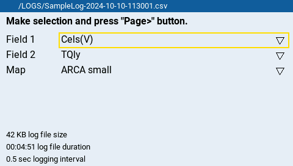

# GPS Viewer

GPS Viewer is an EdgeTX app for the Radiomaster TX16S transmitter that lets users plot logged flight telemetry data with respect to location on a map.  This is especially useful for identifying areas with poor radio transmission signal quality. 

It's also useful for assessing flight path consistency over multiple laps and verifying that the aircraft remains within the desired air space.

GPS Viewer is a modification of [Log Viewer](https://github.com/offer-shmuely/edgetx-x10-scripts/wiki/LogViewer) by Offer Shmuely, which is for plotting telemetry with respect to time.

## Installation

Copy the `SCRIPTS` directory to your transmitter.

Optionally copy the `LOGS` directory to your transmitter if you'd like to have a sample log file with which to try out the app.

## Use

To open the app, press the system button on your transmitter and select GPS Viewer.

1. Select log files to index.  This step measures the duration of each log file and determines which fields have data that changes over time.  Invalid log files are ignored as described in the [Log File Requirements](#log-file-requirements) section below.

    

2. Select a log file from the index.  For large log files, it is recommended to set the accuracy to 1/10.  This will plot every 10th point and make the sticks more responsive in step 4 below.

    

3. Select fields to plot, a map to plot on, and the plot style.  Fields with data that doesn't change over time are excluded.

    

4. View the plot.  You can use the control sticks to select a subinterval of the timeline to plot and inspect individual data points.

    - elevator stick: zoom timeline
    - aileron stick: pan timeline
    - rudder stick: move crosshair
    - scroll wheel: fine tune crosshair
    - scroll button: toggle user interface
    - next page button: toggle telemetry field

    

To exit the app, press and hold the return button.

## Satellite Image

For flights at your local airfield, you can either use the included blank map or add a 480x272 satellite image of your airfield to the `SCRIPTS/TOOLS/gpsViewer` directory and update [lib_config.lua](SCRIPTS/TOOLS/gpsViewer/lib_config.lua) with the minimum and maximum longitude and latitude coordinates of your image.

To generate a 480x272 satellite image, you can use [this map generator](https://ethosmap.hobby4life.nl/).  Alternatively, you can use [Google Maps](https://www.google.com/maps), take a screenshot, and manually crop and resize it using a free image editing program like [Gimp](https://www.gimp.org/).

## Log File Requirements

Log files are ignored if they don't have a GPS field or are over 2 MB in size.  The size limit can be increased by editing [lib_config.lua](SCRIPTS/TOOLS/gpsViewer/lib_config.lua), but this will result long load times.  Instead, to keep log files small, it is recommended to use a logging frequency of 1 Hz or less in EdgeTX.